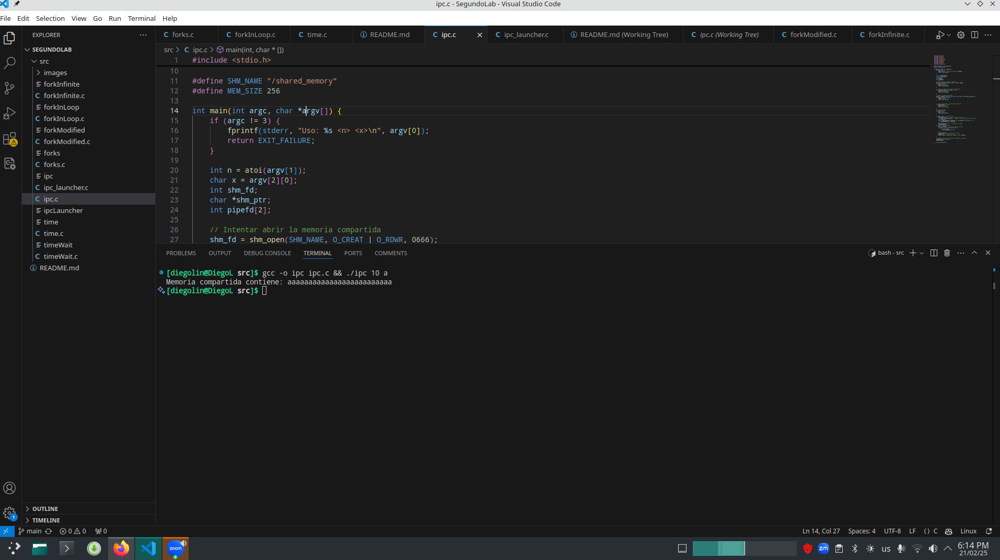
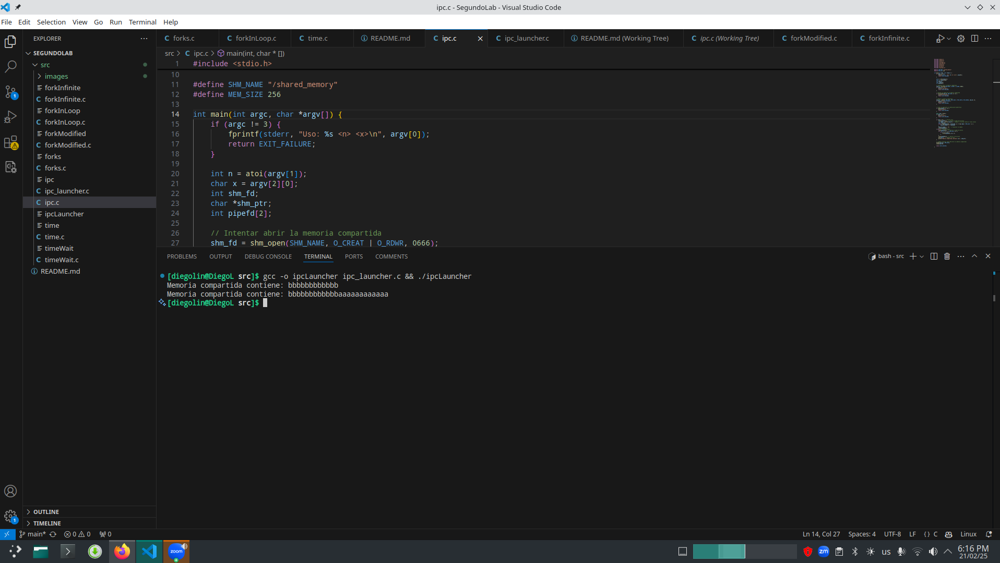

# Laboratorio 2 - Sistemas Operativos

Este proyecto contiene dos programas en C que demuestran el uso de llamadas al sistema `fork()` y `execl()` para la creación y manejo de procesos.

## 🚀 Compilación

Para compilar los programas, asegúrate de estar en el mismo directorio que los archivos `forks.c` y `forksInLopp.c`. Luego ejecuta estos comandos en la terminal:

```bash
gcc -o forkInLoop forkInLoop.c && ./forkInLoop
gcc -o forks forks.c && ./forks
gcc -o timeWait timeWait.c && ./timeWait
gcc -o time time.c && ./time
gcc -o forkInfinite forkInfinite.c && ./forkInfinite
```

Este proyecto contiene dos programas en C que demuestran el uso de memoria compartida y pipes para la comunicación entre procesos:

- **ipc.c**: Escribe datos en una región de memoria compartida utilizando un pipe entre un proceso padre e hijo.
- **ipc_launcher.c**: Ejecuta dos instancias de `ipc.c` con diferentes parámetros y borra la memoria compartida al inicio y al final.

## 🚀 Compilación
Para compilar los programas y ejecutarlos.

```bash
gcc -o ipc ipc.c && ./ipc ./ipc <n> <x>
gcc -o ipcLauncher ipc_launcher.c && ./ipcLauncher
```
Donde:

    <n> es un número que determina cada cuántos caracteres escribir.
    <x> es el carácter a escribir.
Si ejecutas solo el programa ipc.c Para verificar si la memoria compartida sigue existiendo, use:
```bash
ls -l /dev/shm
```
Si ve el archivo shared_memory, puede eliminarlo manualmente con:
```bash
rm /dev/shm/shared_memory
```
Ahora el programa ipc_launcher se encargara de boorar todo espacio de memoria antes y despues de la ejecucion.
Pero por que no se hace en ipc.c directamente ejecutando `shm_unlink(SHM_NAME);` Directamente? Pues porque si se haria de esta forma el segundo programa el de ipc_launcher ejecutaria el primer proceso escribiria en memoria lo que tiene que escribir y ya cuando sea turno del segundo proceso la memoria se habria borrado dando como resultado una escritura nueva en un espacio de memoria 'nueva' y no llegar a los resultados esperados.

### Ejemplos de ejecucion: 

Ejecucion del programa ipc:


Ejecución del programa ipc_launcher
